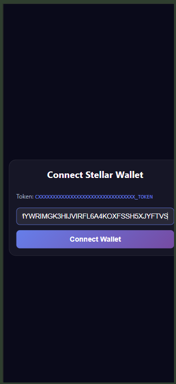
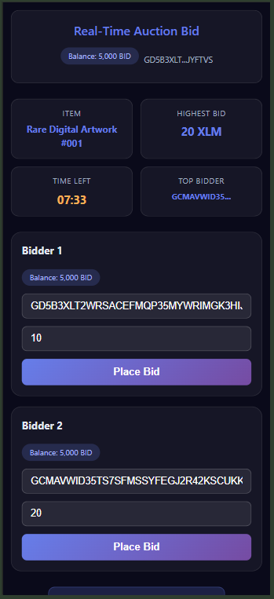
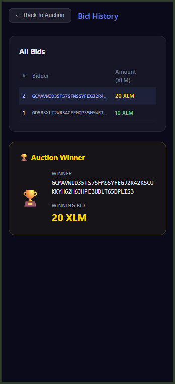

# ⚡ Real-Time Auction Bid dApp — Level 4

A production-ready decentralized auction platform built with React (Vite) and two inter-connected Soroban smart contracts on Stellar Testnet.

---
🔗 Live Demo

https://real-time-auction-level4.vercel.app/

---

🎥 Demo Video

https://drive.google.com/file/d/1lcefv5ondDaTJN8SP-Y2sVt7SSImHTA6/view?usp=sharing

---

✅ CI/CD Pipeline Running

https://github.com/sayali19425-gif/real-time-auction-level4/actions/workflows/ci.yml

---

## 📱 Mobile Responsive View

<p align="center">
  
  
  
</p>

## 📋 Contract Addresses & Transaction Hashes

### 🪙 Token Contract — AuctionToken (BID Token)

| Property | Value |
|----------|-------|
| **Token Contract Address** | `CAJUKKY6MS762KHY7ZHDG7QJBWK3ITKZUGRZYXUCR47SSRB2NESDJ32E` |
| **Token Name** | BidToken |
| **Token Symbol** | BID |
| **Decimals** | 7 |
| **Initial Supply** | 1,000,000 BID |
| **Deploy Transaction Hash** | `df09b59bffd0eae1ff924b45d73a2e336ea6fddb34be1570bac7e3231aed9848e` |
| **Explorer Link** | [View Token Contract](https://lab.stellar.org/r/testnet/contract/CAJUKKY6MS762KHY7ZHDG7QJBWK3ITKZUGRZYXUCR47SSRB2NESDJ32E) |

---

### 🔨 Auction Contract — AuctionBid v2 (Inter-Contract Calls)

| Property | Value |
|----------|-------|
| **Auction Contract Address** | `CAHFHMVJNNCS6DPQH23F4GJPQG2EUIY545V3T6KBH4NVBWG3EWKJGS3Z` |
| **Deploy Transaction Hash** | `03ae8657158dc099d7d1b269a6a96a88bfffbe037ffbc40f89190ca8825f9ace6` |
| **Explorer Link** | [View Auction Contract](https://lab.stellar.org/r/testnet/contract/CAHFHMVJNNCS6DPQH23F4GJPQG2EUIY545V3T6KBH4NVBWG3EWKJGS3Z) |

---

### 🔗 Inter-Contract Call Flow
```
AuctionBid Contract
CAHFHMVJNNCS6DPQH23F4GJPQG2EUIY545V3T6KBH4NVBWG3EWKJGS3Z
        │
        │── calls ──▶ AuctionToken Contract
                CAJUKKY6MS762KHY7ZHDG7QJBWK3ITKZUGRZYXUCR47SSRB2NESDJ32E
                    ├── balance(bidder)   ← verify tokens before bid
                    └── transfer(winner, owner, amount) ← on auction end
```

---

## ✨ Features

### Level 3 (Base)
- Wallet connection with Stellar public key
- Real-time auction countdown timer
- Dual bidder panels with bid validation
- Bid comparison logic

### Level 4 (New)
- ✅ Custom BID Token Contract (mint, burn, transfer)
- ✅ Inter-contract calls (balance check + token transfer)
- ✅ Separate Bid History page with winner display
- ✅ GitHub Actions CI/CD pipeline
- ✅ Mobile responsive design
- ✅ Deployed on Vercel

---

## 🔧 Tech Stack

| Layer | Technology |
|-------|-----------|
| Frontend | React, Vite, JavaScript |
| Styling | CSS with media queries |
| Smart Contracts | Rust, Soroban SDK 21.7.7 |
| Blockchain | Stellar Testnet |
| CI/CD | GitHub Actions |
| Hosting | Vercel |

---

## 📁 Project Structure
```
Real-time-auction-bid/
├── .github/
│   └── workflows/
│       └── ci.yml
├── contract/
│   ├── auction_token/
│   │   ├── src/lib.rs
│   │   └── Cargo.toml
│   └── auction_bid_v2/
│       ├── src/lib.rs
│       └── Cargo.toml
├── frontend/
│   ├── src/
│   │   ├── App.jsx
│   │   ├── App.css
│   │   ├── BidHistory.jsx
│   │   └── BidHistory.css
│   └── package.json
├── deploy.sh
└── README.md
```

---

## 🛠️ Local Setup
```bash
git clone https://github.com/sayali19425-gif/Real-time-auction-bid
cd real-time-auction/auction-dapp/frontend
npm install
npm run dev
```

Open `http://localhost:5173`

---

## 👩‍💻 Author

Sayali — building decentralized applications on Stellar blockchain.

## 📜 License

Open-source for educational purposes.
